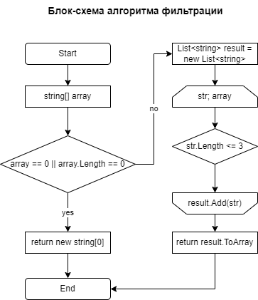

# Final-control-work
Final control work on the basis block

## Как работает программма
Программа принимает массив строк и фильтрует его, оставляя только те строки, длина которых меньше или равна трем символам. Затем программа выводит отфильтрованный массив на экран.

## Блок-схема алгоритма

## Пример
Пример ввода и вывода:
["Hello", "2","world",":-)"] -> ["2",":-)"]

## Лицензия
Этот проект лицензирован в соответствии с лицензией [MIT License](LICENCE)
