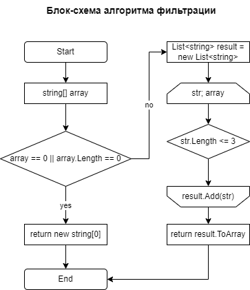

# Final-control-work
Final control work on the basis block

## Что делает программма
Программа принимает массив строк и фильтрует его, оставляя только те строки, длина которых меньше или равна трем символам. Затем программа выводит отфильтрованный массив на экран.

## Подробное описание работы программы
Сначала программа выводит сообщение "Введите элементы массива через запятую" и ожидает ввода пользовательской строки с клавиатуры. Эта строка представляет собой исходный массив строк, введенных через запятую.
После ввода строки программа использует метод Split() для разделения введенной строки на подстроки, используя запятую в качестве разделителя. Результатом является массив строк initialArray.
Программа применяет метод Trim() ко всем элементам массива initialArray, чтобы удалить начальные и конечные пробелы. Это делается для того, чтобы избежать случайного наличия пробелов в введенных строках.
Далее программа вызывает метод FilterStrings() и передает в него массив initialArray. В этом методе происходит фильтрация элементов массива: из массива удаляются все строки, длина которых больше 3 символов. Результатом является новый массив строк, содержащий только те строки, которые соответствуют условию.
Наконец, программа выводит отфильтрованный массив строк на консоль, разделяя его элементы запятыми, используя string.Join()

## Блок-схема алгоритма

## Пример
Пример ввода и вывода:
["Hello", "2","world",":-)"] -> ["2",":-)"]

## Лицензия
Этот проект лицензирован в соответствии с лицензией [MIT License](LICENCE)
